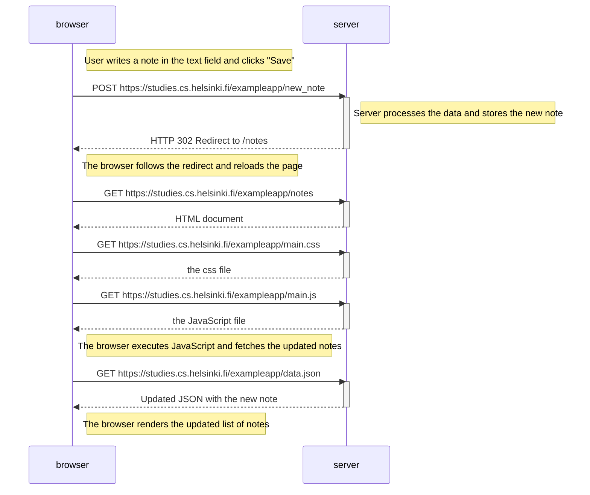

```mermaid
sequenceDiagram
    participant browser
    participant server

    Note right of browser: User writes a note in the text field and clicks "Save"

    browser->>server: POST https://studies.cs.helsinki.fi/exampleapp/new_note
    activate server
    Note right of server: Server processes the data and stores the new note
    server-->>browser: HTTP 302 Redirect to /notes
    deactivate server

    Note right of browser: The browser follows the redirect and reloads the page

    browser->>server: GET https://studies.cs.helsinki.fi/exampleapp/notes
    activate server
    server-->>browser: HTML document
    deactivate server

    browser->>server: GET https://studies.cs.helsinki.fi/exampleapp/main.css
    activate server
    server-->>browser: the css file
    deactivate server

    browser->>server: GET https://studies.cs.helsinki.fi/exampleapp/main.js
    activate server
    server-->>browser: the JavaScript file
    deactivate server

    Note right of browser: The browser executes JavaScript and fetches the updated notes

    browser->>server: GET https://studies.cs.helsinki.fi/exampleapp/data.json
    activate server
    server-->>browser: Updated JSON with the new note
    deactivate server

    Note right of browser: The browser renders the updated list of notes
```
