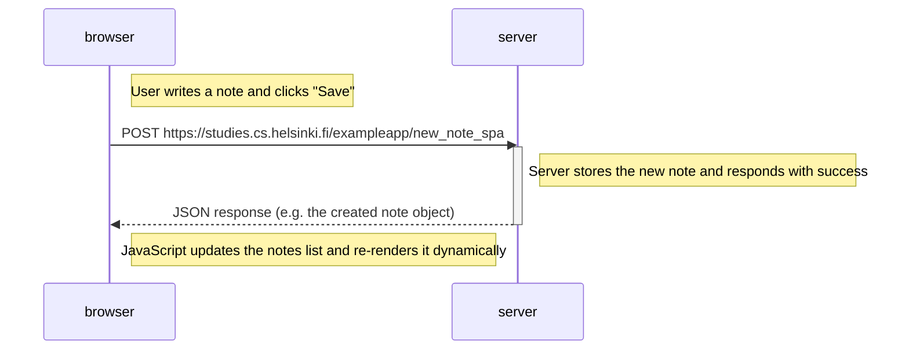

```mermaid
sequenceDiagram
    participant browser
    participant server

    Note right of browser: User writes a note and clicks "Save"

    browser->>server: POST https://studies.cs.helsinki.fi/exampleapp/new_note_spa
    activate server
    Note right of server: Server stores the new note and responds with success
    server-->>browser: JSON response (e.g. the created note object)
    deactivate server

    Note right of browser: JavaScript updates the notes list and re-renders it dynamically
```